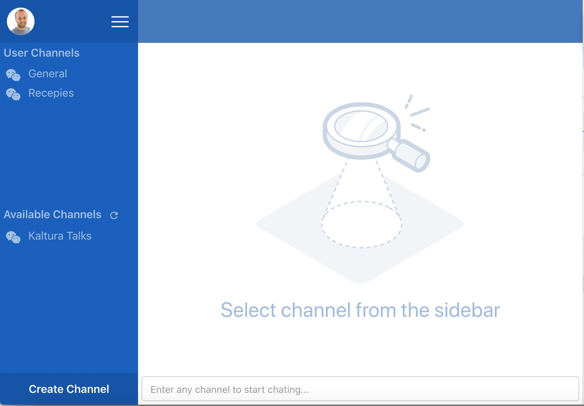

# React Workshop - Chat Application

This is a two days workshop, during which we will learn create a chat application. The workshop is focused on the frontend side and leave all the heavy lifting of the backend side to [pusher chatkit](https://pusher.com/chatkit).



# Setup the workshop application
Do the following if you wish to run the workshop application.

1. checkout branch [workshop-application](https://github.com/esakal/react-workshop/tree/workshop-application).
2. re-download dependencies:
```
rm -rf node_modules
npm install
```
3. create a developer 30 days trial account in [pusher chatkit](https://pusher.com/chatkit)
4. once logged in, create an instance of chatkit application
5. in pusher dashboard access the new instance and navigate to `credentials` section. 
6. copy `.env.template` file into `.env`
  - set `REACT_APP_CHATKIT_TOKEN_PROVIDER` and `REACT_APP_CHATKIT_INSTANCE_LOCATOR` with values from the pusher `credentials` section.
  - set `REACT_APP_USER_ID` with your github user id (not email)
  - NOTE that everytime you change values in `.env` file you must run `serve` again, they are not being tracked by CRA.
7. open the `console` section in pusher dashboard and create new room.
7. go over to users and add new user with your github user id. make sure that user is joined to the room you created.
9. run the application `npm run serve`, navigate to `http://localhost:3000` to open the application.

That's it, you are ready to guide the workshop.

# About this workshop
This workshop was created as a preparation to a course about React hooks, state managements (using context), routing and some other advanced techniques. [Unit 'Novice-2'] elaborate about whats' included in this workshop. Keep in mind that we aim to use hooks where possible, this workshop was created to provide essential information prior to the course.

This workshop is divided into small units and each unit is divided into tasks. 

1. Participant complete a task based on a checklist of requirements.
2. Before continuing to next task, the trainer perform a joined session to review the suggested solution, provide insights and reasoning about the implementation and answer questions.
2. Each task changes can be viewed in a dedicated pull request to simplify tracking changes and code implementation.
3. Under each unit the tasks are related so the participant can decide if he wants to continue with his code or checkout a prepared branch if his code is incomplete.

> Although anyone can follow the unit guides and complete this workshop, it was build based on the assumption that after each task the trainer will provide insights and reasoning about the implementation. 

# Agenda

## Day I
- **Unit 'Novice-1' ([link to unit instructions](./workshop-guides/1-novice/novice-1.md))**: This unit covers creation of project using [Create React App project](https://github.com/facebook/react/) (a.k.a CRA). This library exists to "Get Started Immediately", "Create React apps with no build configuration”. click here to read more about their [pilosophy](https://github.com/facebook/create-react-app#philosophy)

- **Unit 'Novice-2' ([link to unit instructions](./workshop-guides/1-novice/novice-2.md))**: This unit covers product and technical requirements as well as some architecture and design decisions

- **Unit 'Novice-3' ([link to unit instructions](./workshop-guides/1-novice/novice-3.md))**: This unit covers practical use-cases with components.

## Day II
- **Unit 'Intermediate-1' ([link to unit instructions](./workshop-guides/2-intermediate/intermediate-1.md))**: This unit deals with techniques to break any application into components using flexbox as our layout system.

- **Unit 'Intermediate-2' ([link to unit instructions](./workshop-guides/2-intermediate/intermediate-2.md))**: This unit deals with techniques to break any application into components using flexbox as our layout system.


## Trainer notes
If you want to find reasoning for each task, see my [personal notes](./workshop-guides/trainer)

### Things to improve
- Once the participants started to chat in rooms, they needed to scroll manually to see new messages. I think it would be wise to add auto scroll of channel in branch [workshop-application](https://github.com/esakal/react-workshop/tree/workshop-application).
- consider adding usage of classnames to one of the tasks and discuss about
	- `<div className={classnames(className)} />` where className is `undefined`
	- `<div className={classnames(className, {'global-css-name': condition)} />`
	- `<div className={classnames(className, {[classes.localClassName]: condition)} />`  
  
