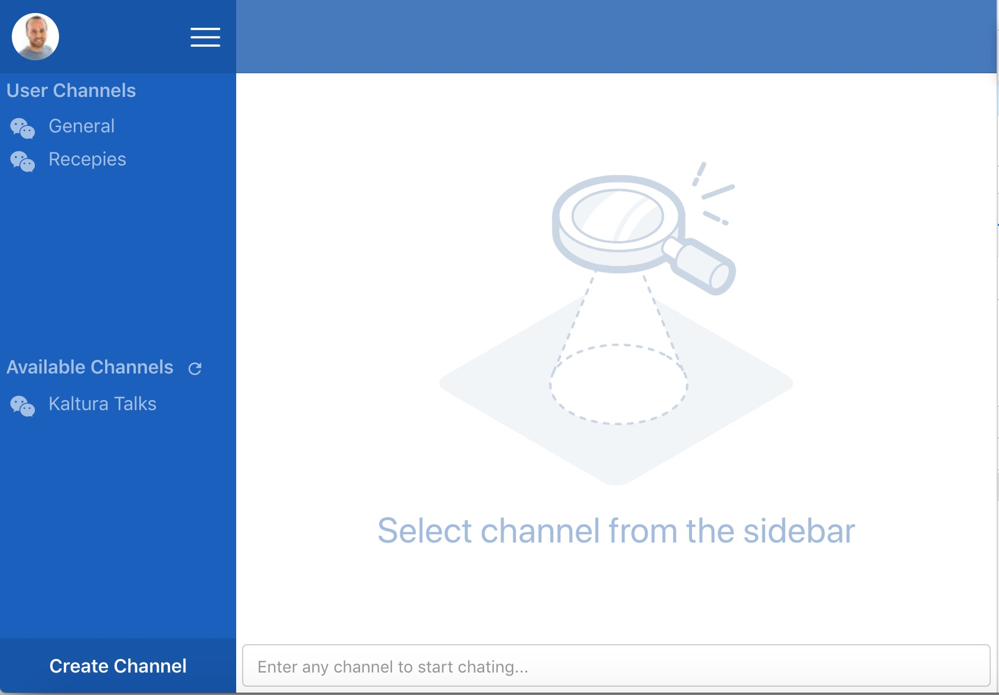

# React workshop - Epic Novice-2

## Overview
This epic covers product and technical requirements as well as some architecture and design decisions

Enjoy!

## The workshop chat application
During this workshop we will create a chat application. We will focus on the frontend side and leave all the heavy lifting on the server side to [pusher chatkit](https://pusher.com/chatkit).



The product provided us his requirements for the POC. 

## Epic Tickets

### Ticket Novice-2 
- [ ] read the following information about this product

#### Product requirements
1. Provide a cloud base service to manage backend logic as setting cuepoints on videos will not make sense in our case 
2.  Chose cloud service that will allow integrating with our user data base for authentication
3. User should be able to create new channels.
4. User should be able to send messages in channels that he joined or craeted.
5. User should be able to join rooms created by others.
6. UX team to provide the dashboard layout


#### Product assumptions
1. No need to support mobile 
2. No need to support accessibility as part of the POC
3. The cloud service supports all the common chat features like channels super user management, online users, indication when user it typing, private rooms etc...
4. No need to develop login views as we will use single sign on services.
5. message can be simple at the moment, in the future they must support links and rich text.

#### High level architecture
1. **Backend services**: As mentioned above, after many hours spent, we decided to go with [pusher chatkit](https://pusher.com/chatkit) as it meets both the POC requirements and the overall requirements.
2. **Frontend framework**: We will use React to develop this application
3. **Code language**: Typescript
4. **UI layout**: flexbox (as targeted browsers [support flexbox](https://caniuse.com/#feat=flexbox)) - there is a extremely useful cheatsheet article [here](https://css-tricks.com/snippets/css/a-guide-to-flexbox/)
 5. **UI components library**: [Material-UI](https://material-ui.com/)
 6. **State Management**: Not part of this workshop, see "Technology assumptions" section below.

#### Technology assumptions
> This workshop focuses on react components prior to Hooks. A future workshop will cover all the cool new features like Hooks, Context, Suspense etc. As such we will create the POC with the following assumptions.

1. **Lack of error strategy implementation**. no specific error strategy will be handled in this workshop, we will try to write workable code but in this workshop we will not protect against async call failure, network issues, unhandled runtime error issues ([error boundaries](https://reactjs.org/docs/error-boundaries.html)) etc.
2. **Parial component techinque/types coverage**. This workshop covers class components and functional components. The following will be discussed in future workshops/courses: HOC, Render Props, Function components (used with [hook](https://reactjs.org/docs/hooks-intro.html))
 3. **No state management**. We will not cover Redux in this workshop, not write context on our own. It will be done once we will learn to work with hooks.
4. **Our code doesn't need tests**. At least not at the moment. Obviously we recommend writing useful and relevant tests when possible
5. **Some more goodies were left out**. we will not use virtualization to optimize showing channels with tons of messages. no async-await practice will be used and we will not create an application theme. If themes interest you please refer to [material ui documentation](https://material-ui.com/customization/themes/).
6. **releasing resources when unmounting**. It is important to always cleanup resources when unmounting but it usually requires some advanced techniques to overcome things like Promise that is not cancellable. There are common techniques that should be followed and we will discuss about it a bit but will not elaborate about it during this workshop.

### Ticket Novice-2.1
- [x] decide about project structure. actually it was already decided, keep reading.

1. all components should exists under `src/components`
2. each component should have its' own folder. using kebab-case for file names
```
src
  |- components
     |- component-name
        |- component-name.tsx
        |- component-name.css
        |- index.ts
```
3. a 2nd nesting is allowed, don't ask for more nesting.
4. component class names should following UpperCamelCase format.
