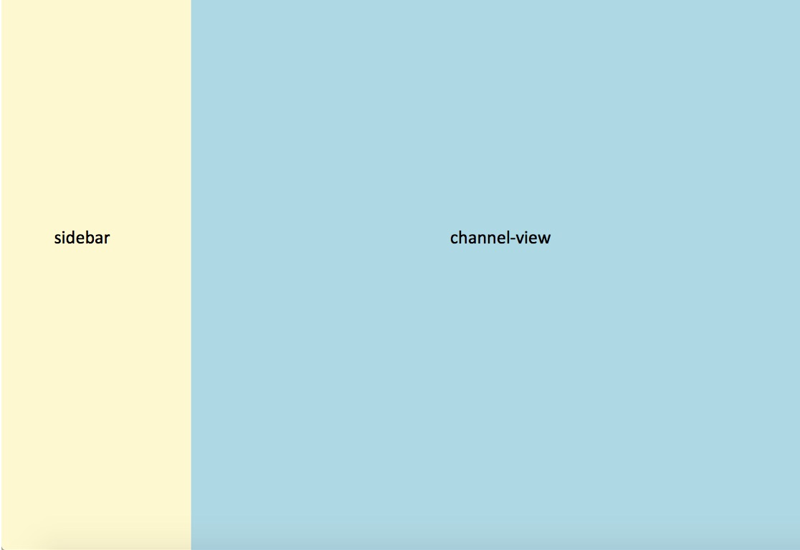
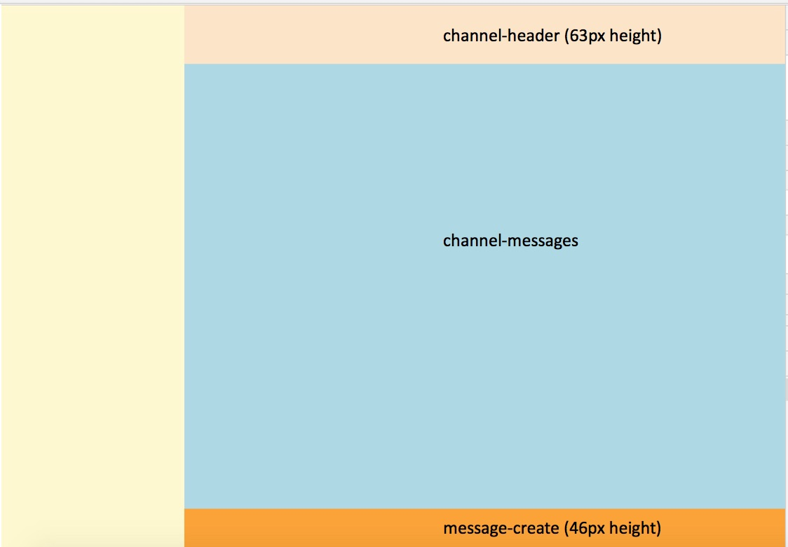
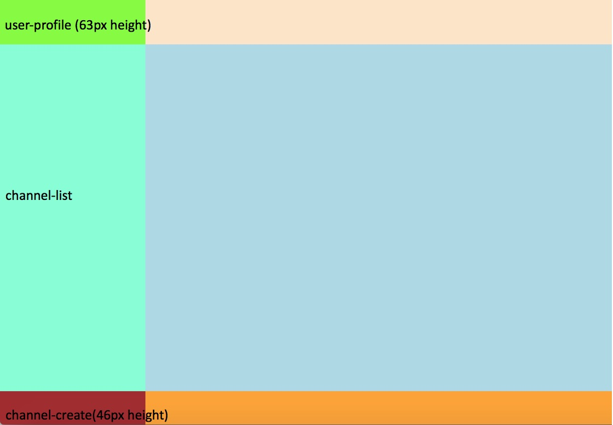

# React workshop - Epic Intermediate-1

## Overview
This epic layout the application components tree using flexbox 

Enjoy! 

## Epic Tickets

> NOTICE: before you start working, please checkout  [intermediate-1](https://github.com/esakal/react-workshop/tree/intermediate-1) and use it to develop this epic tasks

### Ticket Intermediate-1
- [ ] create the following layout. use the names shown in the diagram. you should expect total of 3 components 

### Ticket Intermediate-1.1
> You can continue your work or checkout and continue with branch [intermediate-1.1](https://github.com/esakal/react-workshop/tree/intermediate-1.1)

- [ ] create file `plopfile.js`
```
module.exports = plop => {
  plop.setGenerator('component', {
    description: 'Create a component',
    prompts: [
      {
        type: 'input',
        name: 'name',
        message: 'What is your component name?'
      },
    ],
  });
};
```
- [ ] add the following files (empty for now)
```
plop-templates
  |- components
    |- index.ts.hbs
    |- {{kebabCase name}}.module.css.hbs
    |- {{kebabCase name}}.tsx.hbs
```
- [ ] use one of the existing components as a reference and try to fill the `hbs` files. 
  - use `npm run generate` to run the plop generator
  - read [plop documentation](https://plopjs.com/documentation/#case-modifiers) about case modifiers
  - read [handlebars documentation](http://handlebarsjs.com/) to set variables
 
### Ticket Intermediate-1.2
> You can continue your work or checkout and continue with branch [intermediate-1.2](https://github.com/esakal/react-workshop/tree/intermediate-1.2)

- [ ] create the following layout. use the names shown in the diagram. you should expect total of 6 components 

### Ticket Intermediate-1.3
> You can continue your work or checkout and continue with branch [intermediate-1.2](https://github.com/esakal/react-workshop/tree/intermediate-1.2)
- [ ] create the following layout. use the names shown in the diagram. you should expect total of 9 components 

## Epic Highlights  
- flexbox

## Epic References
- [a complete guide to flexbox](https://css-tricks.com/snippets/css/a-guide-to-flexbox/)
